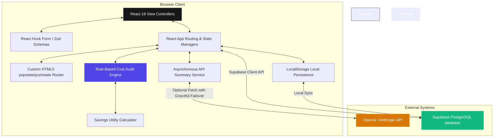

# Architectural Design & Flow | Sift AI Spend Audit 🏗️

This document outlines the software architecture, modular directory structures, data flows, and scaling plans for **Sift AI Spend Audit Platform**.

---

## 🗺️ System Component Diagram

Sift operates as a high-performance, single-page application (SPA) with automatic fallback structures to ensure high availability and zero operational crashes:

---

## ⚡ Data Flow Sequence

1. **Ingestion Stage:**
   - User inputs AI tool specs (tool, plan tier, monthly budget, active seats) in `SpendForm`.
   - `React Hook Form` enforces instant real-time inline format validation.
   - On submission, `Zod` executes comprehensive schema checks, parsing input variables safely.
2. **Audit Stage:**
   - The validated inputs are dispatched to `auditEngine.js`.
   - The engine iterates through the platform list and triggers rules in `auditRules.js` based on default seat cost metrics defined in `plans.js`.
   - Savings formulas in `savingsCalculator.js` compute granular monthly and annual recovery projections.
3. **Async Enhancement Stage:**
   - While the loading progress circle animates inside `LoadingPage.jsx`, the results are cached.
   - On Results mount, the application fires a background request to `aiSummaryService.js` to query OpenAI or Anthropic API endpoints.
   - If keys are missing or the API returns an error, the system instantly resolves the deterministic summary fallback text with **zero latency**.
4. **Persistence & Sync Stage:**
   - The page compiles the unique report hash and saves the report data in `LocalStorage` as a backup.
   - The Supabase client attempts to upload the report to `audit_reports`. If unconfigured, the app logs a console alert and runs seamlessly in local mode.
   - User submits their contact lead (`email`, `company`, `role`). The system saves it directly into the `audit_leads` table via `leadService.ts` with instant error catch-guards.

---

## 💎 Technical Stack Decisions

| Layer | Technology Choice | Architectural Rationale |
| :--- | :--- | :--- |
| **Framework** | **React 19** | Leverage React 19's fast fiber reconciler, concurrent hooks (`useCallback`, `useMemo`), and improved native form support. |
| **Tooling** | **Vite 8** | Hot module replacement (HMR) speeds under 50ms and rollup production builds producing clean, minified bundle fragments. |
| **Validation**| **React Hook Form + Zod** | Avoids expensive re-renders on keystroke (uncontrolled inputs mapped to React state) and handles precise TS type parsing. |
| **Persistence**| **Supabase + LocalStorage** | Ensures enterprise data syncing in the cloud, while guaranteeing a 100% resilient fallback framework locally. |
| **Routing** | **Custom HTML5 History** | Bypasses large third-party routing bundle weights. Only 40 lines of clean code reacting to custom history events. |

---

## 📈 Scaling to 10,000 Audits / Day

To support high-velocity viral acquisition (10k audits daily) without performance degradation, the following enhancements should be implemented:

1. **Edge-Network CDN Static Distribution:**
   - Distribute compiled `dist/` bundles on globally cached CDN edges (e.g. Vercel Edge Server or Cloudflare Pages), reducing initial load times to under 120ms globally.
2. **Database Pooling & Connection Management:**
   - Integrate connection poolers (like **Supabase Supavisor** in transaction mode) to manage up to 10k concurrent Postgres connections without locking database resources.
3. **API Rate Limiting & Queueing:**
   - Deploy a simple edge function (Vercel Edge or Cloudflare Worker) to rate-limit lead submissions (e.g. 5 requests/minute per IP) using Redis token buckets.
   - Offload the LLM AI Summary queries to an asynchronous queue (e.g. Upstash or BullMQ) to avoid blocking main thread responses during peak loads.
4. **Prompt & Summary Caching:**
   - Cache OpenAI/Anthropic API summaries under a SHA-256 hash of the input tool parameters. Duplicate stack compositions (e.g. standard ChatGPT + Claude Pro configurations) can immediately resolve from Redis cache instead of re-querying expensive LLM tokens.
5. **Static Generation of Popular Reports:**
   - Generate static static pages for highly shared report IDs, serving them directly from edge cache without invoking database query pools.
