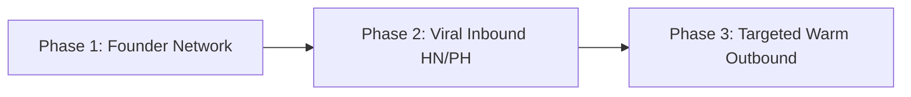

# Go-To-Market (GTM) Plan | Sift AI Spend Audit 🚀

This document maps out our Go-To-Market strategy, focusing on high-impact customer segments, target acquisition channels, and an actionable plan to secure Sift’s first **100 enterprise organizations**.

---

## 🎯 1. Ideal Customer Profile (ICP)

Sift’s highest-converting target segment is not early-stage bootstrapped hackathons or slow, multi-month corporate bureaucracies. Our ICP is defined as follows:

* **Segment:** High-growth, venture-backed tech startups and scale-ups.
* **Team Size:** 20 to 150 employees (specifically with engineering-to-other-department ratios > 40%).
* **Key Pain Point:** Rapid adoption of developer AI tools (Cursor, Copilot, ChatGPT, API tokens) leading to unchecked, opaque card billings. Product managers and engineers are concurrently buying tools without central IT visibility.
* **Target Buyer persona:** Head of Finance, VP of Engineering, or CTO (the individuals who hold the corporate budget, review monthly SaaS spending, but do not have time to manually audit active slack channels and Billing logs).

---

## 📣 2. Focused Marketing Channels

We will target our ICP through three highly specific acquisition channels, completely avoiding expensive, broad programmatic search ads:

### Channel A: Programmatic LinkedIn Executive Outbound
* **Action:** Build automated outreach funnels targeting VP of Finance, Head of Engineering, or VP of People at seed to Series-B startups.
* **The Pitch:** *"Hey [Name], your developers are likely using both Cursor and GitHub Copilot concurrently, double-paying for autocompletes. Run this 60-second read-only audit to see exactly how much you can reclaim."*

### Channel B: Side-Project Lead-Magnet Marketing (Viral Audit Link)
* **Action:** Launch Sift as a free public cost calculator on **Product Hunt**, **Hacker News**, and **TL;DR Newsletter**. 
* **Mechanic:** Startups enter their estimated stack details. The platform generates a beautiful public dashboard and highlights a single teaser cost leak (e.g., *"You are losing $300/mo on redundant team seats"*). The user enters their email to unlock the complete custom PDF checklist, turning traffic into warm inbound leads.

### Channel C: Chrome Extension Seating Scanner
* **Action:** Launch a free, secure Chrome Extension that helps finance managers inspect active Google Workspace SSO SAML tables for duplicate user accounts across OpenAI, Anthropic, and Vercel.

---

## 📈 3. Actionable Plan to Acquire First 100 Customers

We will execute a structured, three-phase outreach blueprint to secure Sift’s first 100 recurring company subscriptions:

### Phase 1: High-Trust Alpha Cohort (Users 1-15) — Weeks 1-2
* **Tactic:** Tap the founder's direct network (Y-Combinator portfolios, VC startup cohorts). 
* **Offer:** Offer a 100% free "Concierge Audit" where Sift manual engineers scan their Workspace billing PDF. We gather real-world overspending models (which feeds back into improving Sift's automated rules) in exchange for detailed testimonials.

### Phase 2: Inbound Growth Spark (Users 16-50) — Weeks 3-4
* **Tactic:** Coordinate a top-tier Launch on Product Hunt and Hacker News. 
* **Offer:** Release the Free Audit Calculator. Capture lead captures through the PDF Report Dispatch form, converting warm traffic into active leads. Offer a 30-day free trial of our continuous billing monitor.

### Phase 3: Outbound Scale (Users 51-100) — Weeks 5-8
* **Tactic:** Deploy warm LinkedIn outbound based on specific tech-stack footprints. 
* **Offer:** Scan publicly visible technology registries (e.g., finding companies hiring Cursor developers but listing Copilot on their LinkedIn jobs list). Send a personalized audit mockup showing exactly $250/mo in potential redundancies, driving them to run an automated Sift Audit.
