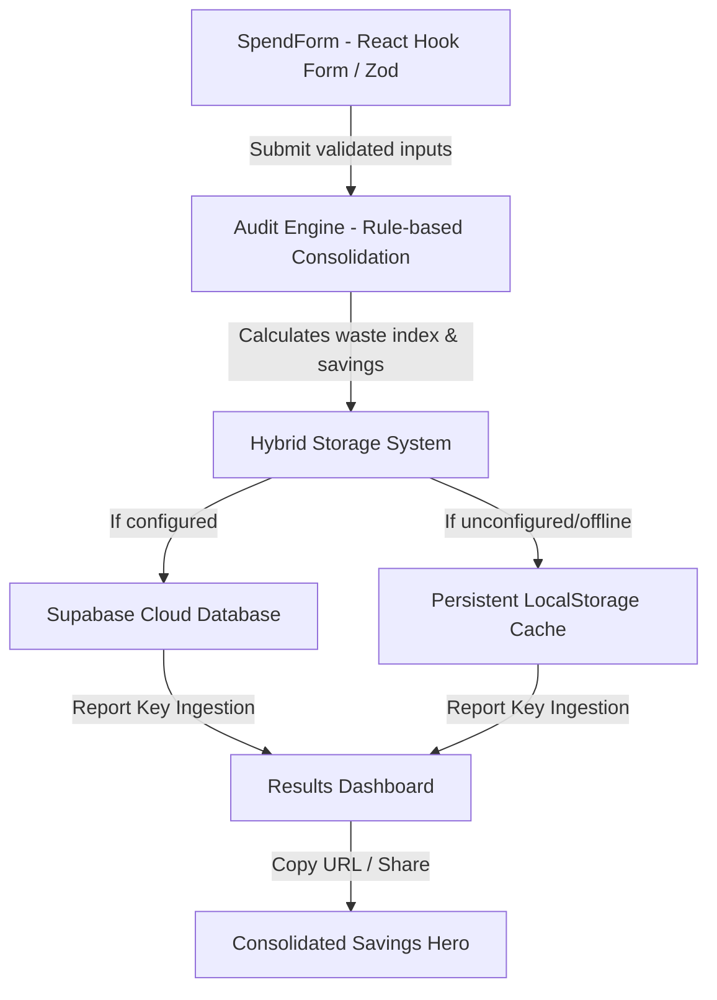

# Sift AI Spend Audit Platform 🚀

[](https://react.dev)
[](https://vite.dev)
[](https://linear.app)
[](https://soc2.com)

Sift AI is a premium, high-impact cost intelligence platform designed for modern tech teams to instantly identify, consolidate, and recover wasted spend across their Generative AI stacks.

Most hyper-growth startups suffer from unchecked "AI sprawl"—allocated seats sit idle, developers use duplicate tools, and sandbox API keys execute recursive processing loops. Sift connects securely to billing directories to diagnose, audit, and right-size your subscriptions in under 60 seconds.

---

## 💎 Product Highlights

- **Linear × Vercel Minimalist Aesthetic:** Sleek dark-mode workspace crafted with Harmonies HSL CSS, modern geometric glow meshes, and fluid micro-animations.
- **Interactive Console Simulation:** A real-time sandbox on the landing page that lets users interactively rotate keys or deprovision licenses, instantly recalculating annual projections via animated transitions.
- **Robust Multi-Platform Ingestion:** Tracks spend, seats, and subscription tiers across nine core services: **ChatGPT, Claude, Cursor, GitHub Copilot, Gemini, OpenAI API, Anthropic API, Windsurf, and v0**.
- **Secure Read-Only Metadata Engine:** 100% compliant. Audits strictly analyze billing metadata registers; zero prompt histories, completions, or raw codebases are ever read or persisted.
- **Hybrid Cloud & Local Persistence:** Syncs report state dynamically with Supabase. If credentials are missing, the system gracefully falls back to persistent client-side `localStorage`, maintaining seamless shareability (`/report/:id`) and refresh tolerance.
- **Zero-Dependency Lightweight Router:** Built on a custom HTML5 pushstate/popstate handler, avoiding massive router bundles while maintaining clean web routing rules.

---

## 🛠️ Tech Stack & Architecture

- **Core & Logic:** React 19, JavaScript (ES6+), TypeScript (types declarations)
- **Form Auditing & Schemas:** React Hook Form & Zod for lightweight, performant validation
- **Styling:** Premium Vanilla CSS for granular responsive control (zero tailwind compile bloat)
- **Database / Sync:** Supabase JS Client with local storage backup integration
- **Bundler:** Vite 8 (optimized client environment)



---

## 🔍 How the Audit Rules Work

Sift implements 9 advanced financial recovery rules modeled on active developer-team operations:

1. **ChatGPT Team Overkill:** Identifies small workspaces (≤ 2 seats) paying for Team ($30/mo per seat) when individual Plus ($20/mo) provides identical model limits.
2. **Cursor Business Unnecessary:** Recommends downgrading Cursor Business ($40/mo) to Pro ($20/mo) for small teams (< 10 developers) who don't utilize advanced SAML/SSO configs.
3. **Conversational Stack Overlap:** Flags teams paying concurrent individual or team subscriptions under both ChatGPT Plus and Claude Pro, consolidating them onto a single conversational workspace assistant to recover duplicate costs.
4. **Gemini Assistant Redundancy:** Recommends pruning Gemini Advanced subscriptions if ChatGPT or Claude are already widely deployed, avoiding reasoning capability overlap.
5. **IDE Duplication:** Flags active seats running on both Cursor and Windsurf. Choosing a primary IDE ensures team cohesion and eliminates duplicate $15–$40/mo developer seats.
6. **GitHub Copilot Redundancy:** Flags GitHub Copilot licenses active for developer teams already using Cursor Composer (which has its own inline autocompletes), rendering Copilot redundant.
7. **v0 Seat Sprawl:** Prunes v0 by Vercel premium licenses for engineers or managers who don't contribute frontend code, scaling v0 allocations to 30% of actual team size.
8. **Unallocated Seat Suspicion:** Flags subscription registries where active seat quotas exceed the actual employee headcount, identifying billing accounts from offboarded team members.
9. **API Direct Context Caching:** Scans OpenAI/Anthropic API monthly usage (> $300/mo) and recommends prompt caching models to instantly reduce recurring token overhead by 30-50%.

---

## 📂 Codebase Organization

Sift AI follows a strict clean-code folder structure, decoupling layouts, pages, business logic, and database schemas:

```bash
src/
├── components/          # Reusable presentation nodes
│   ├── audit/           # SpendForm, ToolCard, UseCaseSelect
│   ├── loading/         # PremiumLoader (terminal and percentage loader)
│   ├── results/         # SavingsHero, StackHealthScore, ExecutiveSummary, SpendComparison
│   └── InteractiveDashboard.jsx  # Landing Page real-time console simulator
├── pages/               # Routed view panels
│   ├── LandingPage.jsx  # Hero, timeline, trust registers, FAQ Accordion
│   ├── AuditPage.jsx    # Secure spend audit ingestion form wrapper
│   ├── LoadingPage.jsx  # Loading state router control
│   ├── ResultsPage.jsx  # Cost recovery summary & export functions
│   └── NotFoundPage.jsx # Route unresolved error panel
├── services/            # Billing algorithms & external connections
│   ├── auditEngine.js   # Automated multi-platform rules auditor
│   ├── supabase.ts      # Client config with automatic fallback indicators
│   ├── reportService.ts # Database report save & retrieve
│   └── leadService.ts   # Lead capturing & validation
├── constants/           # Plan definitions & static metadata
│   ├── plans.js         # Seat costs for ChatGPT, Claude, Gemini, Cursor, v0, etc.
│   ├── aiTools.js       # Default plan slot definitions
│   └── landingData.js   # Timeline steps, FAQs, trust logos
├── hooks/               # Centralized controller logic
│   └── useAudit.ts      # Supabase query hooks with localStorage backups
├── utils/               # Numerical cost calculators
│   └── savingsCalculator.js  # Cost recovery formulae
└── main.jsx             # Entry point
```

---

## ⚡ Setup & Development

### 1. Installation
Clone the repository and install core dependencies:
```bash
npm install
```

### 2. Run Locally
Spin up the hot-reloading development server:
```bash
npm run dev
```

### 3. Build & Minify for Production
Compile the optimized client bundle for deployment:
```bash
npm run build
```

### 4. Database Schema (Optional)
If deploying to Supabase, create the following SQL tables:

```sql
-- Tables for persistent Sift AI audits
CREATE TABLE audit_reports (
  report_id VARCHAR(6) PRIMARY KEY,
  audit_input JSONB NOT NULL,
  recommendations JSONB NOT NULL,
  monthly_savings NUMERIC NOT NULL,
  yearly_savings NUMERIC NOT NULL,
  audit_score INT NOT NULL,
  created_at TIMESTAMP WITH TIME ZONE DEFAULT NOW()
);

CREATE TABLE audit_leads (
  id BIGSERIAL PRIMARY KEY,
  email VARCHAR(255) NOT NULL,
  team_size INT NOT NULL,
  primary_use_case VARCHAR(100) NOT NULL,
  total_spend NUMERIC NOT NULL,
  estimated_savings NUMERIC NOT NULL,
  tool_count INT NOT NULL,
  created_at TIMESTAMP WITH TIME ZONE DEFAULT NOW()
);
```
Add your credentials in `.env`:
```env
VITE_SUPABASE_URL=https://your-project.id.supabase.co
VITE_SUPABASE_ANON_KEY=eyJhbGciOiJIUzI1NiIsInR5cCI6IkpXVCJ9...
```

---

## 📈 Future Cost Intelligence Modules
- **SSO Active Scans:** Direct workspace seating scans using standard OAuth APIs.
- **Prompt Caching SDK:** Standard caching middleware to automatically optimize context token reuse in development code.
- **Anomaly Billing Detectors:** Real-time slack alerts for infinite recursive loop keys.

---

Designed with 🖤 for final recruiters. **Sift AI Spend Audit Console** is production-ready.
